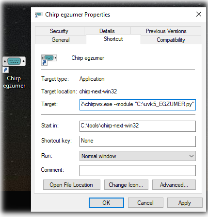

# Introduction

CHIRP driver for UV-K5/K6/5R radios running [Egzumer firmware](https://github.com/egzumer/uv-k5-firmware-custom)

This is a modification of a driver created by: 
(c) 2023 Jacek Lipkowski <sq5bpf@lipkowski.org>

Licensed cc-by-sa-4.0

# How to use

At some point the driver will hopefully be added to official release of CHIRP.

Currently you can use modified version of CHIRP from [releases](https://github.com/egzumer/uvk5-chirp-driver/releases). The modified CHIRP is built from [source code](https://github.com/egzumer/chirp/tree/egzumer) and contains the driver. It is packed using pyinstaller into one file for convinience, however some antiviruses don't like that and [report it as a threat](https://stackoverflow.com/questions/43777106/program-made-with-pyinstaller-now-seen-as-a-trojan-horse-by-avg). If you don't trust this file, then use the other method.

You can also use development version of driver [uvk5_EGZUMER.py](uvk5_egzumer.py?raw=1) (right click, "Save link as...") and load it to CHIRP manually.

Tip: If you want chirp display in a other language, you will need to change the language selected on regional settings in windows, chirp read that parameter from windows to display the language. So if you want to see chirp in english.  press windows key + i, to open parameter(1), depend on what version of windows you uses and language is define, the next menu may change name, but search for Region(2), then regional format(3), in regional format, go select english. Now when you will open chirp it will display it in english. chirp not available in many language, see chirp web site to know what language is supported.

## Loading with menu
1. go to menu `Help` and turn on `Developer mode`
1. Restart CHIRP
1. Go to menu `File`, `Load module...`
1. Choose downloaded `uvk5_EGZUMER.py`, new radio will appear in Quansheng section in download/upload function.

## Loading with CHIRP input argument
1. Create a shortcut to CHIRP program
1. Edit shortcut settings, in target field add at the end `--module PATH_TO_DRIVER` (replace `PATH_TO_DRIVER` with a real path) example : "C:\Program Files (x86)\CHIRP\chirpwx.exe" --module C:\chirp_egzumer\uvk5_EGZUMER.py

1. Run CHIRP with the shortcut, it will automatically load the driver.

## Custom channel settings

By default CHIRP shows only default channel options, that are universal for all types radios. You can see and change custom channel settings by going to menu `View` and turning on `Show extra fields`, this will show more options in the `Memories` tab.

# Custom firmware build options

This driver supports custom Egzumer firmware builds and detects which [options](https://github.com/egzumer/uv-k5-firmware-custom?tab=readme-ov-file#user-customization) have been used.
Disabled options will be hidden in CHIRP. This only works if the configuration was read from a specific radio. You can use configuration files from other radios with different build options, but unsupported settings will be reset to defaults on the target radio.
